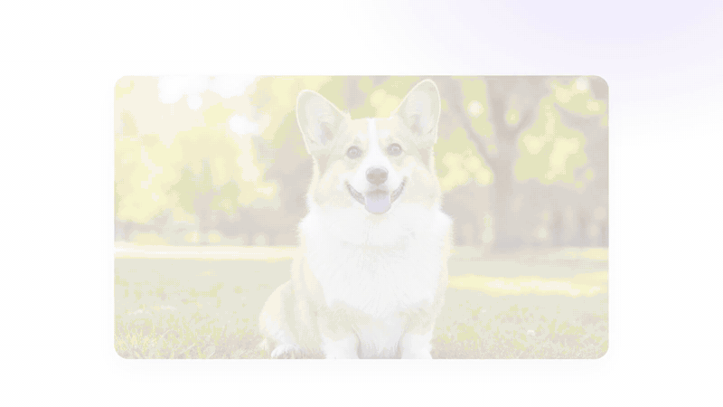
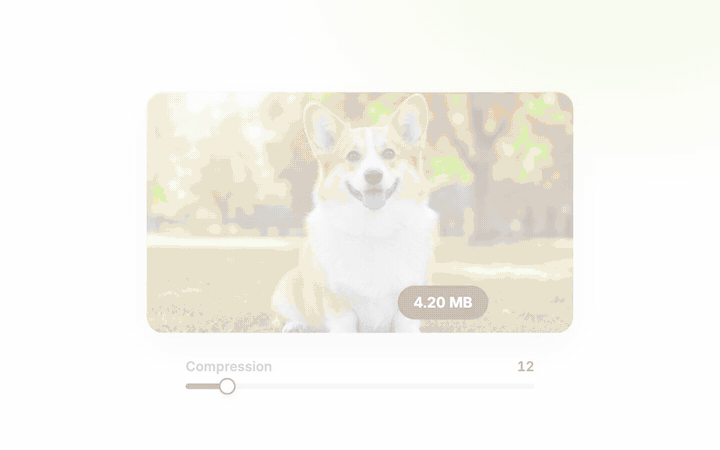
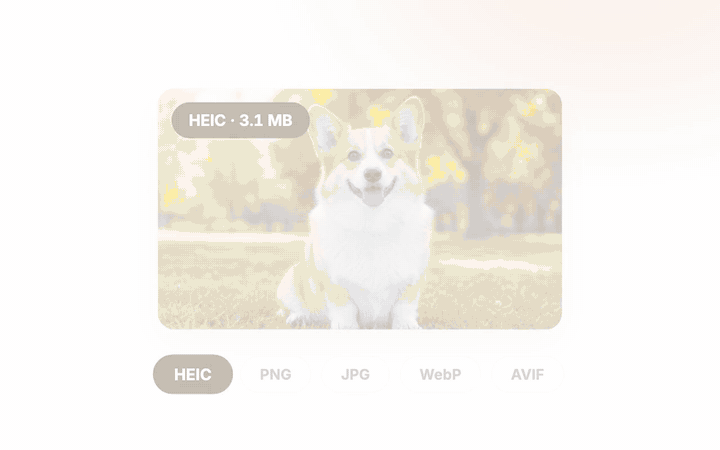
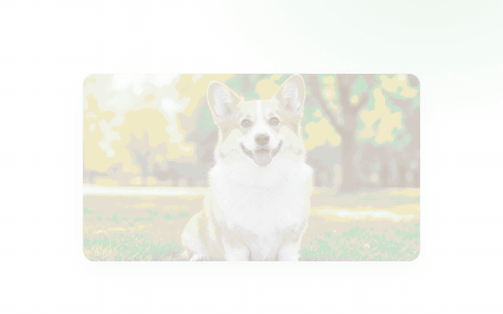
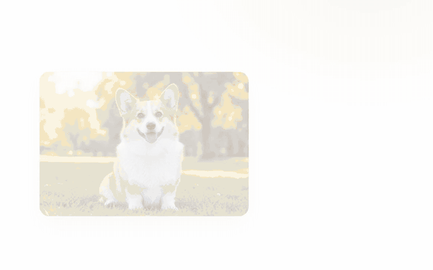
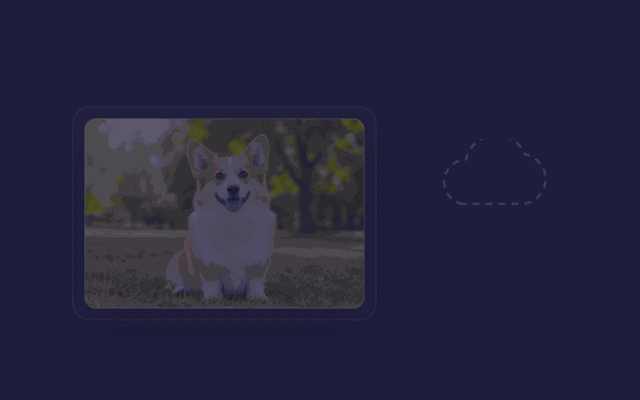

<div align="center">

🌐 English · [中文](README.zh.md)

</div>

# LumiPic

**Free, private, in-browser image toolkit — every pixel stays on your device.**

[](https://pic.sevzq.com)
[](#under-the-hood)
[](#under-the-hood)
[](#why-its-different)
[](LICENSE)
[](https://github.com/sevzq/lumipic/stargazers)

AI background removal, smart compression, format conversion, precise cropping and
EXIF stripping — all inside your browser. **No uploads, no accounts, no watermarks,
no limits.** The model, the codecs, the whole pipeline run on your device.

**Try it now → [pic.sevzq.com](https://pic.sevzq.com)**



[Tools](#tools) · [Why it's different](#why-its-different) · [Under the hood](#under-the-hood) · [Development](#development) · [Deployment](#deployment)

---

## Tools

| Tool | Engine |
| --- | --- |
| **Remove Background** | BiRefNet_lite (SOTA dichotomous segmentation, MIT) via transformers.js + WebGPU, refined with a fast guided filter for hair-level edges |
| **Compress** | Squoosh WASM codecs (MozJPEG / OxiPNG / WebP / AVIF) + TinyPNG-style palette quantization (image-q) |
| **Convert** | PNG / JPG / WebP / AVIF output — iPhone HEIC, GIF and BMP input included |
| **Crop** | Freeform marquee or ratio presets, rotate / flip, original format preserved |
| **Strip EXIF** | Lossless container rewrite for JPEG / PNG / WebP — GPS, timestamps and device info gone, pixels untouched |

<table>
  <tr>
    <td width="50%">
      <b>Compress</b> — 80% smaller, visually identical<br><br>
      
    </td>
    <td width="50%">
      <b>Convert</b> — HEIC to AVIF in one step<br><br>
      
    </td>
  </tr>
  <tr>
    <td width="50%">
      <b>Crop</b> — exactly what you frame<br><br>
      
    </td>
    <td width="50%">
      <b>Strip EXIF</b> — share the photo, not your location<br><br>
      
    </td>
  </tr>
</table>

Batch up to 60 files (80 MB each), compare before/after with a slider, download
one by one or as a ZIP. English and Chinese UI (`/` and `/zh`).

## Why it's different

Most "free online image tools" upload your photos to a server, queue them, watermark
them, or cap you at N images per day. LumiPic can't do any of that — **by architecture**:

- **Zero uploads.** Images are read into Web Workers and never leave the tab.
  There is no upload endpoint at all; the server only serves static files.
- **Self-hosted AI, no third-party CDN.** The segmentation model
  (`public/models/`) and the ONNX runtime (`public/ort/`) are served from the
  same origin. After the first visit everything is cached — it even works offline.
- **State of the art, not a toy.** BiRefNet is the current open-source SOTA for
  dichotomous segmentation; compression uses the exact codecs behind Squoosh.
- **Free forever.** No account, no watermark, no daily quota — there is no
  server cost that would force any of those.



## Under the hood

```
drop image ──▶ Web Worker (comlink RPC)
                 ├─ remove-bg   BiRefNet_lite fp16 · WebGPU · transformers.js
                 │              └─ guided-filter edge refinement at full resolution
                 ├─ compress    MozJPEG / OxiPNG / WebP / AVIF WASM (+ image-q palette)
                 ├─ convert     HEIC / GIF / BMP in → PNG / JPG / WebP / AVIF out
                 └─ strip-exif  lossless container rewrite
                       ▼
              transparent PNG / optimized file — straight back to your disk
```

### Adaptive HD / Fast tiers

Two BiRefNet_lite graphs ship with the app, picked at runtime:

| Tier | Input | Needs | Who gets it |
| --- | --- | --- | --- |
| **1024 HD** | 1024 px | `maxStorageBuffersPerShaderStage ≥ 11` | Chrome 146+ on Windows / Linux |
| **512 Fast** | 512 px | any WebGPU adapter | macOS (Metal caps the limit at 10), older Chrome, Safari |

This is a browser limitation, not a hardware one — even an M-series Mac falls back
to 512 because Chrome's Metal backend currently exposes at most 10 storage buffers
per shader stage. The guided-filter refinement always runs at the **original**
resolution, so edge quality stays high on both tiers. If the 1024 graph fails at
inference time (e.g. Safari OOM), the worker disposes it and retries on 512
automatically. Open `/gpu-check.html` on the deployed site to see your adapter's verdict.

### Stack

- **Next.js 16** (App Router, standalone output) + TypeScript + Tailwind CSS v4
- **Motion** (framer-motion v12) — spring physics UI animations
- **next-intl** — English / Chinese, path-based routing
- **zustand + comlink** — state and worker RPC
- **COOP / COEP** headers — cross-origin isolation for multi-threaded WASM
- **Remotion** — the landing-page demo clips are rendered React compositions (`remotion/`)

## Development

```bash
pnpm install            # also copies the ONNX runtime into public/ort
pnpm fetch:models       # one-time ~200 MB model download into public/models
pnpm dev
```

The landing-page demo videos are Remotion compositions:

```bash
pnpm demos:studio       # live-edit the clips
pnpm demos:render       # re-render all mp4s into public/demos
```

## Deployment

The [Dockerfile](Dockerfile) fetches the models at build time and runs the
standalone Next server — deploy it anywhere a container runs. For
[Railway](https://railway.app):

```bash
railway up --service web
```

`pic.sevzq.com` is a proxied Cloudflare CNAME to the Railway service.

## Design

"Figma-editorial" — monochrome chrome on a white canvas, one pastel color block
per tool (lilac / lime / coral / mint / cream), Inter with tight display
tracking, and a transparency checkerboard wherever alpha appears.

## Contributing

Issues and PRs welcome. If LumiPic saved you an upload, **[⭐ star the repo](https://github.com/sevzq/lumipic)** — it helps others find it.

## License

[MIT](LICENSE) © SevenZhang
